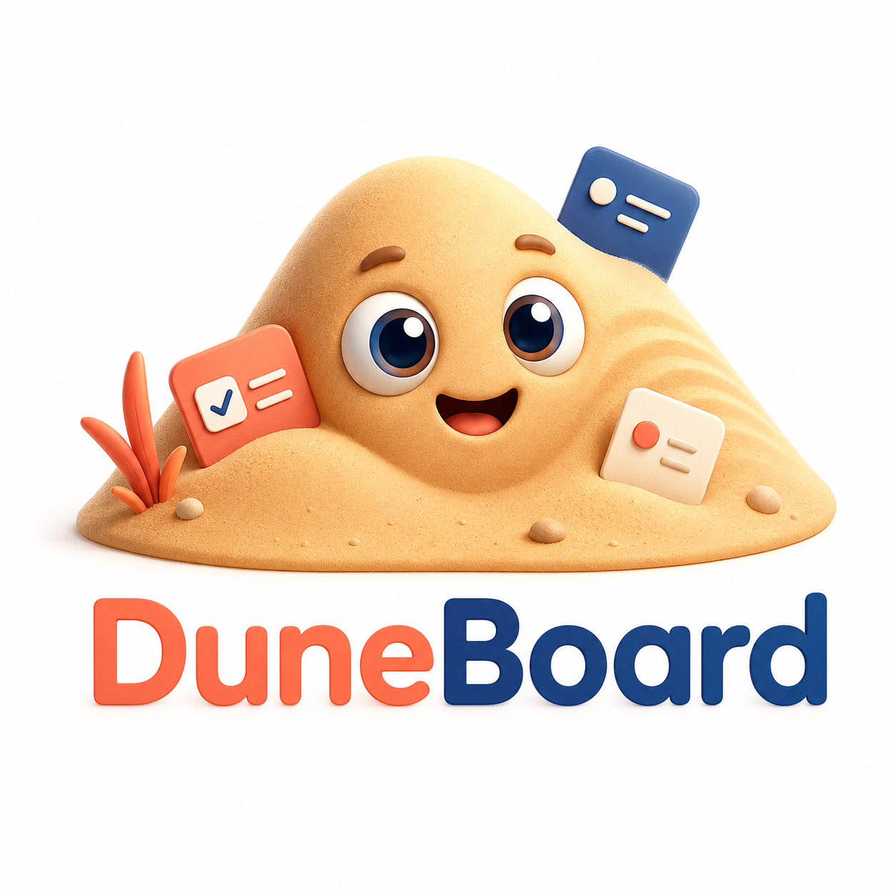

# DuneBoard

<p align="center">
  
</p>

DuneBoard is a local-first task graph for AI agents and humans.

The project goal is simple: keep task management in Markdown files, then render
those files as a fast visual board, graph, and agent-ready execution queue.

## Status

Minimal skill pack release. `v0.6.0` adds validated DuneBoard skills for normal
agent task handling, Azure DevOps import, and local project cleanup while
keeping the instructions small and DuneBoard-specific.

## Why

Agent runtimes need a task system that is easy to read, easy to edit, and safe
for many agents to use in parallel. Traditional Kanban boards are useful as a
view, but agents also need dependency graphs, parent-child decomposition,
open questions, work logs, and clear readiness rules.

## Principles

- Markdown is the source of truth.
- Kanban is a view, not the core model.
- The core model is a task graph.
- Humans should understand the project by reading files.
- Agents should use narrow commands and skills instead of ad hoc edits.
- The smallest useful workflow wins.

## Planned Shape

```text
tasks/
  DB-0001-project-mvp.md
  DB-0002-markdown-task-schema.md
  DB-0003-task-graph-engine.md
.duneboard/
  config.yml
skills/
  duneboard-agent/
apps/
  web/
packages/
  core/
  cli/
```

## Example Task

```markdown
---
id: DB-0002
title: Define Markdown task schema
kind: task
status: ready
priority: P1
parent: DB-0001
depends_on: []
labels: [core, mvp]
---

## Goal
Create a minimal task file format that agents and humans can edit safely.

## Acceptance Criteria
- [ ] Schema supports parent-child relationships
- [ ] Schema supports predecessor-successor dependencies
- [ ] Schema validates status, kind, priority, and IDs

## Work Log
```

## Documentation

- [Vision](docs/vision.md)
- [Product spec v0.1](docs/product-spec-v0.1.md)
- [Architecture](docs/architecture.md)
- [Task schema](docs/schema/task-file.md)
- [CLI workflow](docs/cli-workflow.md)
- [Web UI](docs/web-ui.md)
- [Agent skill design](docs/agent-skill-design.md)
- [GitHub workflow](docs/github-workflow.md)
- [Roadmap](ROADMAP.md)
- [Changelog](CHANGELOG.md)

## Skills

Codex skills use `SKILL.md` as the required entrypoint. The skill name comes
from the folder and YAML frontmatter.

- [duneboard-agent](skills/duneboard-agent/SKILL.md): operate a DuneBoard board
  safely.
- [duneboard-import-ado](skills/duneboard-import-ado/SKILL.md): convert Azure
  DevOps work into DuneBoard tasks.
- [duneboard-organize-local-project](skills/duneboard-organize-local-project/SKILL.md):
  clean up local specs and task notes into a DuneBoard board.

## Project Board

This repository dogfoods the planned format in [tasks](tasks/). Those files are
the first DuneBoard board and will become parser fixtures as the implementation
starts.

## Run Locally

```bash
pnpm install
pnpm dev
```

The preview UI runs at `http://127.0.0.1:5173`.

To open another DuneBoard project, point the UI at a board root:

```powershell
$env:DUNEBOARD_ROOT = "C:\Users\evgen\source\repos\Achiever\DuneBoard"
pnpm dev
```

CLI commands run through:

```bash
pnpm dune validate
pnpm dune next
pnpm dune task create --title "Example task"
```

## Current Preview

The first runnable preview is read-only. It parses the repository task files,
builds a board index, and renders list, board, graph, ready queue, task detail,
and validation views.

## License

MIT
