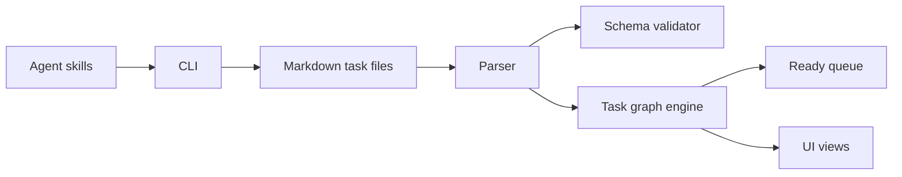

# Architecture

DuneBoard is local-first. The file system is the database.



## Packages

Planned structure:

```text
packages/
  core/       # task schema, validation, graph engine
  cli/        # command line interface for humans and agents
apps/
  web/        # local React UI
skills/
  duneboard-agent/
```

## Technology Direction

- TypeScript for the initial core, CLI, and UI.
- React + Vite for the local web interface.
- React Flow for graph rendering.
- Zod for runtime schema validation.
- Tauri later if a packaged desktop app becomes necessary.

## Data Flow

1. Read live Markdown files from configured task roots.
2. Parse frontmatter and body sections.
3. Validate each task independently.
4. Build cross-task indexes.
5. Validate graph-level rules.
6. Render UI views or print CLI output.
7. Write changes back to Markdown with minimal churn.

## Board Configuration

Boards may define task roots in `.duneboard/config.yml`:

```yaml
task_roots:
  - tasks
```

The CLI writes new tasks to the first configured root. Additional roots are read
for validation and graph indexing.

Within each configured task root, DuneBoard treats these paths as live board
input:

- root-level Markdown task files such as `tasks/DB-0001-title.md`;
- task-owned bundle files such as `tasks/DB-0001-title/task.md`, when a project
  adopts a bundle layout.

The immediate `archive/` subtree under each task root is historical material:
`<taskRoot>/archive/**` is not parsed, validated, indexed, or included in
`next`. Archived Markdown may keep old task frontmatter, duplicate IDs, source
specs, status logs, and migration reports without affecting the live board. If a
project needs archive analysis later, that should be an explicit archive command
or mode rather than the default live scan.

## Invariants

- Task IDs are unique.
- `depends_on` cannot contain unknown task IDs.
- Dependency edges must not create cycles.
- A task cannot be `available` until all dependencies are `done`.
- Done tasks should include completion evidence in the work log.
